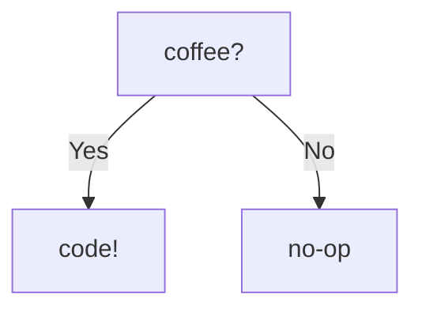

## Hello, I'm Thiago (thd)! 👋

I’m a software engineer, entrepreneur, and educator living in Vancouver, Canada. 🏞️

**I’m on a mission to help developers grow and get better at their software engineering skills** -> [@hexdevs](https://www.hexdevs.com)

- I love Ruby and Elixir
- I write about software development on my blog ☄️[thd.codes](https://www.thd.codes).
- I co-host the hexdevs podcast 🎙️ with Stefanni Brasil.
- I am a core-maintainer of [faker-ruby](https://github.com/faker-ruby/faker) 🎭

Previously [@patch.io](https://github.com/patch-technology), [@cto.ai](https://github.com/cto-ai).
Currently [@jane technologies](https://github.com/janetechinc/) and [@hexdevs](https://github.com/hexdevs).

I have a degree in Computer Science, was pursuing a Master’s in CompSci. I also have done a bit of research in the field of AI.

- 🔭 I’m currently working on my own business -> [hexdevs](https://www.hexdevs.com/).
- 📫 How to reach me: [@thdaraujo](https://twitter.com/thdaraujo) or e-mail me: thiago at hexdevs dot com
- 😄 Pronouns: he/him
- 🗨️ How to pronounce my name: /chee-AH-go/
- ⚡ Fun fact: My parents were smugglers of computer parts back in the 90s in Brazil (ask me about their story!)
- 🚲 Hobbies: photography, hiking, cycling, cooking and calligraphy.

**How I work:**

